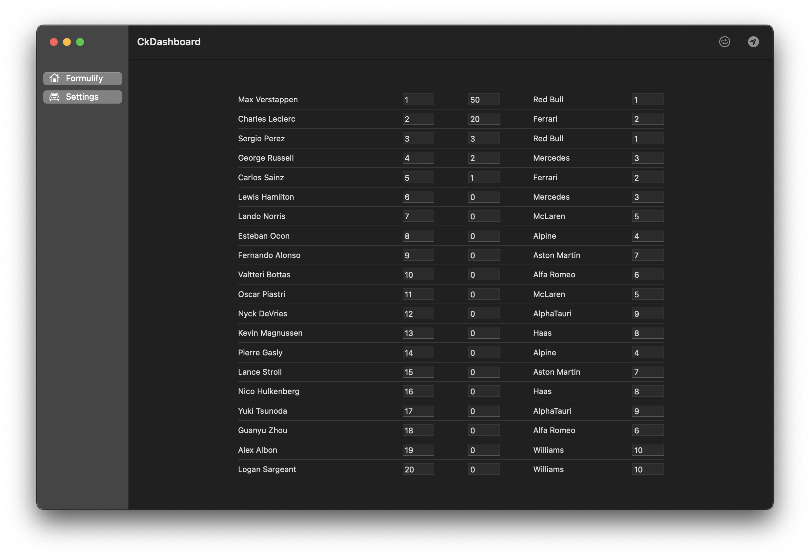

# macOS - CkDashboard
macOS app - CkDashboard. Created using SwiftUI.

<table>
  <tr>
  <td></td>
  </tr>
 </table>

Helper macOS application for updating results of F1 championship standings.
Application fetches latest data from CloudKit database, allows editing fetched data from specified Record Type and pushes updated data sets back to CloudKit.

NOTE: Correct iCloud Container needs to be setUP before using the app.

Target: macOS 12.3

Stack: SwiftUI, Async/Await, CloudKit, MVVM/Viper (Clean Architecture).